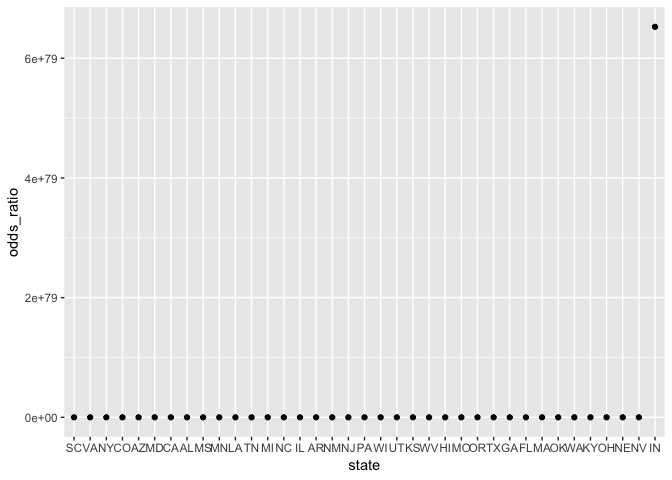

Police Killings Final Report
================
Nathalie Fadel, Chirag Shahs, Jeanette Shekelle, Jaclyn Verity
December 4, 2018

Factors Associated with Police Killings in America in 2015
----------------------------------------------------------

### Motivation

Police killings of black men have been in the media increasingly over the past few years. From Eric Garner to Michael Brown, this is a nationwide problem that Black Lives Matter (and other activist groups) has worked to shed light on to inform and educate the American public. The US is an outlier in police killings globally: the US kills more people in a matter of days than the UK kills over several decades. The goal of this report is to investigate police killings from January through early June across 364 U.S. cities. We seek to understand who has been killed, where, and how the media has skewed our perceptions of these tragedies.

Source: <https://www.theguardian.com/us-news/2015/jun/09/the-counted-police-killings-us-vs-other-countries>

### Dataset

Recognizing that no public database existed for all of the victims of police killings, The Guardian began an interactive database called The Counted to keep track of reported police killings throughout the U.S. FiveThirtyEight stepped in, geocoded the locations of the killings and added selected census data. The dataset used in this report contains individual level data for 467 people killed by police in 2015. It contains 34 variables including: name, age, race, longitude and latitude.

### Initial Questions

The initial questions we sought out to answer were as follows: 1) Where are these killings happening? Specific cities? Specific states? 2) When are the killings happening? Is there a specific month with more killings? 3) What is the racial makeup of people killed by police? 4) How does poverty relate to police killings?

### Exploratory Analysis

**1) Where are these killings happening? Specific cities? Specific states?**

Read in main data set from fivethirtyeight github repository on police killings...

``` r
library(tidyverse)
```

    ## ── Attaching packages ───────────────────────────────────────────────────── tidyverse 1.2.1 ──

    ## ✔ ggplot2 3.0.0     ✔ purrr   0.2.5
    ## ✔ tibble  1.4.2     ✔ dplyr   0.7.6
    ## ✔ tidyr   0.8.1     ✔ stringr 1.3.1
    ## ✔ readr   1.1.1     ✔ forcats 0.3.0

    ## ── Conflicts ──────────────────────────────────────────────────────── tidyverse_conflicts() ──
    ## ✖ dplyr::filter() masks stats::filter()
    ## ✖ dplyr::lag()    masks stats::lag()

``` r
library(reshape2)
```

    ## 
    ## Attaching package: 'reshape2'

    ## The following object is masked from 'package:tidyr':
    ## 
    ##     smiths

``` r
require(RCurl)
```

    ## Loading required package: RCurl

    ## Warning in library(package, lib.loc = lib.loc, character.only = TRUE,
    ## logical.return = TRUE, : there is no package called 'RCurl'

``` r
raw_data = read_csv(
        "https://raw.githubusercontent.com/fivethirtyeight/data/master/police-killings/police_killings.csv"
      )
```

    ## Parsed with column specification:
    ## cols(
    ##   .default = col_character(),
    ##   day = col_integer(),
    ##   year = col_integer(),
    ##   latitude = col_double(),
    ##   longitude = col_double(),
    ##   state_fp = col_integer(),
    ##   county_fp = col_integer(),
    ##   tract_ce = col_integer(),
    ##   geo_id = col_double(),
    ##   county_id = col_integer(),
    ##   pop = col_integer(),
    ##   h_income = col_integer(),
    ##   county_income = col_integer(),
    ##   comp_income = col_double(),
    ##   county_bucket = col_integer(),
    ##   nat_bucket = col_integer(),
    ##   urate = col_double(),
    ##   college = col_double()
    ## )

    ## See spec(...) for full column specifications.

A look into the cities...

``` r
city_data = raw_data %>% 
  mutate(city_state = paste(city, state, sep = ", ")) %>% 
  group_by(city_state) %>% 
  summarise(total_killed = n())
```

Found that most cities have 1 killing in 2015. LA had the most with 9.

``` r
state_level_data = raw_data %>%
  group_by(state) %>% 
  mutate(month = factor(month, levels = c("January", "February", "March", "April", "May", "June", "July", "August", "September", "October", "November", "December")),
         year = as.integer(year)) %>% 
  summarise(total_killed = n())
```

California tops the list with 74 killings, which makes sense since Los Angeles is the city with the highest number of killings (9). It is followed distantly by Texas (46) and Florida (29).

``` r
raw_data %>%
  group_by(state) %>%
  summarise(total_killed = n()) %>%
  mutate(state = forcats::fct_reorder(state, total_killed)) %>%
  ggplot(aes(x = state, y = total_killed)) +
  geom_col(size = 3) +
  labs(x = "State", y = "Killings", 
       caption = "number of police killings in each state, Jan-June 2015") +
  theme(axis.text.x = element_text(angle = 90))
```


This graph shows the distribution of killings among the states.

``` r
raw_data %>%
  group_by(state) %>%
  summarise(total_killed = n()) %>%
  summarise(mean_killed = mean(total_killed)) %>% 
  mutate(std_error = stderr()) %>% 
  mutate(upper_bound = mean_killed + 1.96 * std_error,
         lower_bound = mean_killed - 1.96 * std_error)
```

    ## # A tibble: 1 x 4
    ##   mean_killed std_error upper_bound lower_bound
    ##         <dbl>     <int>       <dbl>       <dbl>
    ## 1        9.94         2        13.9        6.02

On average, there were 9.93 killings per state during the January to June 2015 time period. We are 95% confident that the true average value for this amount/period of time lies between 6.02 and 13.86.

Looking to download data from same resource for 2016. The website has a downloadable csv. Formatted exactly the same. But it is missing census data and the very important latitude and longitude for matching the census data. This is a big draw back for inclusion of 2016 data but let's explore it, anyway.

``` r
raw_2016 = read_csv("./data/the-counted-2016.csv")
```

    ## Parsed with column specification:
    ## cols(
    ##   uid = col_integer(),
    ##   name = col_character(),
    ##   age = col_character(),
    ##   gender = col_character(),
    ##   raceethnicity = col_character(),
    ##   month = col_character(),
    ##   day = col_integer(),
    ##   year = col_integer(),
    ##   streetaddress = col_character(),
    ##   city = col_character(),
    ##   state = col_character(),
    ##   classification = col_character(),
    ##   lawenforcementagency = col_character(),
    ##   armed = col_character()
    ## )

Just looking at the raw data there is a huge increase from 467 killings in 2015 to 1093 in 2016.

``` r
city_data_16 = raw_2016 %>% 
  mutate(city_state = paste(city, state, sep = ", ")) %>% 
  group_by(city_state) %>% 
  summarise(total_killed = n())
```

LA stays the top but more than doubles in deaths. Houston and Pheonix trade places but remain 2 and 3. All the numbers for the top killed have double or quadroupled. This could be inherent that The Guardian was tracking more diligently and that the linked data from FiveThirtyEight is only Jan - Jun for 2015.

``` r
raw_2016 = raw_2016 %>% 
  mutate(cause = classification)

raw_combined = bind_rows(raw_data, raw_2016) %>% 
  mutate(month = factor(month, levels = c("January", "February", "March", "April", "May", "June", "July", "August", "September", "October", "November", "December")),
         year = as.integer(year))

city_data = city_data %>% 
  mutate(year = 2015)

city_data_16 = city_data_16 %>% 
  mutate(year = 2016)

city_combined = bind_rows(city_data, city_data_16) %>% 
  mutate(year = as.factor(year))
```

``` r
top_cities = city_combined %>% 
 top_n(20, total_killed)

ggplot(top_cities, aes(fill = year, x = city_state, y = total_killed)) + geom_bar(position = "dodge", stat = "identity") +
  theme(axis.text.x = element_text(angle = 80, hjust = 1))
```


Most of the Top 20 for police killings occured in 2016. The top 3 in 2016 also made the Top 20 overall. Looks like \# 1 in 2015 would be 6 in 2016.

Including 2016 would give our analysis a lot more power. To include 2016 the locations of death would need to be geocoded and then joined with census data for those census tracts. After finding a free geocoding service through the University of Texas A&M, I realized the 2016 data does not have zipcodes. This makes the task of geocoding for latitude and longitude an enormous undertaking. Each of the 1000+ killing locations would need to be plugged into google maps to retreive the zipcode. At that point we could get the latitude and longitude using that method. It would take hours of monotonous work and is beyond our capabilities for this project.

Cause of Death by Police...

``` r
city_depth_data = raw_combined %>% 
  filter(city %in% c( "Los Angeles", "Houston", "Phoenix", "Chicago", "San Antonio")) %>% 
  mutate(cause = as.factor(cause),
         armed = as.factor(armed))

plot_cause = city_depth_data %>% 
  select(city, cause, year) %>% 
  group_by(city, cause) %>% 
  summarise(freq = n()) %>% 
  spread(key = cause, value = freq) 

plot_cause[is.na(plot_cause)] <- 0

plot_cause1 = plot_cause %>% 
  janitor::clean_names() %>% 
  gather(key = cause, value = freq, death_in_custody:taser) %>% 
  ggplot(aes(fill = cause, x = city, y = freq)) + geom_bar(position = "dodge", stat = "identity") + labs(x = "City", y = "Frequency", title = "Cause of Death by Police Weapon", caption = "2015-2016") + scale_fill_brewer(palette = "Set2") 
  
plot_cause1
```


Victim armed...

``` r
plot_armed = city_depth_data %>% 
  select(city, armed) %>% 
  group_by(city, armed) %>% 
  summarise(freq = n()) %>% 
  spread(key = armed, value = freq) 

plot_armed[is.na(plot_armed)] <- 0

plot_armed1 = plot_armed %>% 
  janitor::clean_names() %>%
  rename(unarmed = no) %>% 
  gather(key = armed, value = freq, firearm:vehicle) %>% 
  ggplot(aes(fill = armed, x = city, y = freq)) + geom_bar(position = "dodge", stat = "identity") + labs(x = "City", y = "Frequency", title = "Victim Armed with a Weapon", caption = "2015-2016") + scale_fill_brewer(palette = "Set2") 
  
plot_armed1
```


*Though 2016 gives us more data to work with it takes away context, with lacking latitude and longitudes we cannot connect the context the census data gives us. We will stick with 2015 data for the rest of the analysis.*

*The vast majority of police killings were happening in California, with 74 total. The city with the most killings was Los Angeles.*

**2) When are the killings happening? Is there a specific month with more killings?**

\[\[Nathalie's Exploratory Analysis\]\]

*This exploration did not yield interesting results. We didn’t initially realize that the dataset was only January - June. Additionally, there was little variation in killings between months.*

**3) What is the racial makeup of people killed by police?**

\[\[Chirag's Exploratory Analysis\]\]

*The majority of people killed were white, with black being the second most common. This was slightly surprising because the media had made us believe that the most common people killed would be black. However, we then thought about the proportionality of race to the overall population and decided that while there were more whites than blacks killed, there was most likely a higher proportion of blacks killed compared to the total population of blacks. Furthermore, it seems that the majority of individuals who were killed were in the age category from 29-38. The distribution of killings seems relatively normal with respect to age with the elderly and the very young being killed the least often.*

``` r
homicides_data = read_csv("https://raw.githubusercontent.com/fivethirtyeight/data/master/police-killings/police_killings.csv") %>%
  janitor::clean_names()
```

    ## Parsed with column specification:
    ## cols(
    ##   .default = col_character(),
    ##   day = col_integer(),
    ##   year = col_integer(),
    ##   latitude = col_double(),
    ##   longitude = col_double(),
    ##   state_fp = col_integer(),
    ##   county_fp = col_integer(),
    ##   tract_ce = col_integer(),
    ##   geo_id = col_double(),
    ##   county_id = col_integer(),
    ##   pop = col_integer(),
    ##   h_income = col_integer(),
    ##   county_income = col_integer(),
    ##   comp_income = col_double(),
    ##   county_bucket = col_integer(),
    ##   nat_bucket = col_integer(),
    ##   urate = col_double(),
    ##   college = col_double()
    ## )

    ## See spec(...) for full column specifications.

``` r
homicides_data = homicides_data %>%
  mutate(month = factor(month, levels = c("January", "February", "March", "April", "May", "June", "July", "August", "September", "October", "November", "December")),
         year = as.integer(year))

homicides_data %>%
  group_by(raceethnicity) %>%
  summarise(total_killed = n()) %>%
  mutate(raceethnicity = forcats::fct_reorder(raceethnicity, total_killed)) %>%
  ggplot(aes(x = raceethnicity, y = total_killed, fill = raceethnicity)) +
  geom_col(size = 3) +
  labs(x = "State", y = "Killings", 
       caption = "number of police killings in each state, Jan-June 2015") +
  theme(axis.text.x = element_text(angle = 90)) +
  scale_fill_brewer(palette = "BrBG")
```


``` r
homicides_data %>% 
mutate(agecat = ifelse(age %in% 0:18, 1, ifelse(age %in% 19:28, 2, ifelse(age %in% 29:38, 3, ifelse(age %in% 39:48, 4, ifelse(age %in% 49:58, 5, ifelse(age %in% 59:68, 6, 7))))))) %>% 
  group_by(agecat) %>%
  summarise(total_killed = n()) %>%
  ggplot(aes(x = agecat, y = total_killed)) +
  geom_col(size = 3) +
  labs(x = "Age Category", y = "Killings", 
       caption = "number of police killings within each age category, Jan-June 2015")
```


**4) How does poverty relate to police killings?**

Data Import and Cleaning...

``` r
raw_data = read_csv("https://raw.githubusercontent.com/fivethirtyeight/data/master/police-killings/police_killings.csv") %>%
  janitor::clean_names()
```

    ## Parsed with column specification:
    ## cols(
    ##   .default = col_character(),
    ##   day = col_integer(),
    ##   year = col_integer(),
    ##   latitude = col_double(),
    ##   longitude = col_double(),
    ##   state_fp = col_integer(),
    ##   county_fp = col_integer(),
    ##   tract_ce = col_integer(),
    ##   geo_id = col_double(),
    ##   county_id = col_integer(),
    ##   pop = col_integer(),
    ##   h_income = col_integer(),
    ##   county_income = col_integer(),
    ##   comp_income = col_double(),
    ##   county_bucket = col_integer(),
    ##   nat_bucket = col_integer(),
    ##   urate = col_double(),
    ##   college = col_double()
    ## )

    ## See spec(...) for full column specifications.

``` r
clean_data = raw_data %>%
  group_by(state) %>% 
  mutate(month = factor(month, levels = c("January", "February", "March", "April", "May", "June", "July", "August", "September", "October", "November", "December")),
         year = as.integer(year)) %>% 
  mutate(total_killed = n()) %>% 
  mutate(pov = as.numeric(pov))
```

    ## Warning in evalq(as.numeric(pov), <environment>): NAs introduced by
    ## coercion

    ## Warning in evalq(as.numeric(pov), <environment>): NAs introduced by
    ## coercion

SES by state level...

``` r
SES_clean_data = 
  clean_data %>% 
  group_by(state) %>% 
  mutate(state_pov = mean(pov)) %>% 
  select(state_pov, state, total_killed, nat_bucket) %>% 
  unique()
```

``` r
SES_clean_data %>% 
  ggplot(aes(x = total_killed, y = state_pov, color = nat_bucket)) +
  geom_point() +
  labs(x = "Total Killings per State", y = "State Poverty Rate", label = "Median Household Income by Quintile Nationally")
```

    ## Warning: Removed 9 rows containing missing values (geom_point).


State poverty level is not related to total killings per state. This is most likely because states like California are very wealthy, but have the highest number of killings (74 total).

*This exploration also did not yield interesting results. We expected to see more killings in areas of higher poverty, but could not see a clear trend. We hypothesize that this is because places with more money (and often more people) still have more killings. Using the example of California, this is easy to see: California had by far the most killings but does not have a high poverty rate. We think more killings is related more closely to population size than poverty level.*

### Additional Analyses

*In addition to the above analyses, we mapped the killings across the U.S. using the longitudes and latitudes provided. This was a helpful way to visualize where in the U.S. killings occurred.*

``` r
raw_data = read_csv(
        "https://raw.githubusercontent.com/fivethirtyeight/data/master/police-killings/police_killings.csv"
      )
```

    ## Parsed with column specification:
    ## cols(
    ##   .default = col_character(),
    ##   day = col_integer(),
    ##   year = col_integer(),
    ##   latitude = col_double(),
    ##   longitude = col_double(),
    ##   state_fp = col_integer(),
    ##   county_fp = col_integer(),
    ##   tract_ce = col_integer(),
    ##   geo_id = col_double(),
    ##   county_id = col_integer(),
    ##   pop = col_integer(),
    ##   h_income = col_integer(),
    ##   county_income = col_integer(),
    ##   comp_income = col_double(),
    ##   county_bucket = col_integer(),
    ##   nat_bucket = col_integer(),
    ##   urate = col_double(),
    ##   college = col_double()
    ## )

    ## See spec(...) for full column specifications.

``` r
map_data2 = raw_data %>% 
  mutate(raceethnicity = as.factor(raceethnicity)) %>% 
  mutate(raceethnicity = fct_relevel(raceethnicity, c("Native American", "Asian/Pacific Islander", "Unknown", "Hispanic/Latino", "Black", "White"))) %>% 
  ggplot(aes(x = longitude, y = latitude, colour = raceethnicity)) + 
  geom_point(alpha = .7, size = 2) + 
  scale_color_brewer(palette = "BrBG") +
  theme(panel.background = element_rect(fill = "grey",
                                colour = "grey",
                                size = 0.5, linetype = "solid"),
        legend.position = "bottom") +
  labs(title = "Police Killings Across the US", color = "Race/Ethnicity")

map_data2
```


*We also played with the idea of performing logistic regression to assess the risk of being black and killed. While we couldn’t quite rationalize race being an outcome, this is a potential area to explore further with a dataset that has many more homicide metrics. The following code and comments show our path to exploring the possibility of using a regression model to describe the odds of being killed in a majority non-white neighborhood.*

### Regression Attempt

``` r
raw_data %>% 
mutate(share_white = as.numeric(share_white)) %>% 
mutate(neighborhood = ifelse(share_white %in% 50:100, 0, 1)) %>% 
  ##0 represents a majority white neighborhood, 1 represents a majority other race neighborhood
  group_by(neighborhood) %>%
  summarise(total_killed = n()) %>%
  ggplot(aes(x = neighborhood, y = total_killed)) +
  geom_col(size = 3) +
  labs(x = "Neighborhood", y = "Killings", 
       caption = "number of police killings within white and non-white neighborhoods, Jan-June 2015")
```

    ## Warning in evalq(as.numeric(share_white), <environment>): NAs introduced by
    ## coercion


This graph depicts the amount of communities that are majority white (0), and majority non-white (1) where killings occured.

``` r
state_models = raw_data %>% 
  mutate(share_white = as.numeric(share_white)) %>% 
  mutate(neighborhood = ifelse(share_white %in% 50:100, 0, 1)) %>% 
  ##0 represents a majority white neighborhood, 1 represents a majority other race neighborhood
  mutate(cause_cat = ifelse(cause == "gunshot", 1, 0)) %>% 
  ##1 represents gunshot, 0 represents other 
  mutate(armed_cat = ifelse(armed == "Firearm", 1, 0)) %>% 
  ##1 represents armed with Firearm, 0 represents armed with other or unarmed
  mutate(p_income = as.numeric(p_income)) %>%
  mutate(thousands_p_income = p_income/10000) %>% 
  group_by(state) %>% 
  ##group by state because we want each distinct city to have a model
  nest() %>% 
    mutate(logit_neighborhood = map(data, ~glm(neighborhood ~ cause_cat + armed_cat + thousands_p_income, family = binomial, data = .x)), 
         logit_neighborhood = map(logit_neighborhood, broom::tidy)) %>% 
  select(-data) %>% 
  unnest() %>% 
  ##using nest and unnest to map the model for all distinct cities in the dataset
  mutate(odds_ratio = exp(estimate), 
         lower_bound = exp(estimate - 1.96*std.error), 
         upper_bound = exp(estimate + 1.96*std.error))
```

    ## Warning in evalq(as.numeric(share_white), <environment>): NAs introduced by
    ## coercion

    ## Warning in evalq(as.numeric(p_income), <environment>): NAs introduced by
    ## coercion

    ## Warning: glm.fit: fitted probabilities numerically 0 or 1 occurred

    ## Warning: glm.fit: fitted probabilities numerically 0 or 1 occurred

    ## Warning: glm.fit: fitted probabilities numerically 0 or 1 occurred

    ## Warning: glm.fit: fitted probabilities numerically 0 or 1 occurred

    ## Warning: glm.fit: algorithm did not converge

    ## Warning: glm.fit: fitted probabilities numerically 0 or 1 occurred

    ## Warning: glm.fit: algorithm did not converge

    ## Warning: glm.fit: fitted probabilities numerically 0 or 1 occurred

``` r
  ##defining odds ratio and upper and lower bounds for the 95% confidence interval
```

The resulting dataframe that was created has parameter estimates, standard error estimates as well as odds ratio values to go along with their respective 95% confidence interval, for every state. Given that the data is only a snapshot of police killings from January to June 2015, we are severely underpowered. Therefore, the associations shown in each state in the graphs below may not be indicative of the true relationship between income and being killed in a majority non-white community as well as being armed and being killed in a majority non-white community. The literature suggests that there exists a relationship for the variables in the latter graph. However, in the future, we should try to find data that will allow us to better define the relevant variables along with a dataset that is substantially larger where a single observation in a particular state wouldn't skew the results so heavily. We ran one final regression model where we try to assess the relationships in our state stratified models irrespective of state.

``` r
state_models %>% 
  filter(term == "thousands_p_income") %>% 
  ##selecting the parameter we want
  select(odds_ratio, lower_bound, upper_bound, state) %>% 
  mutate(state = forcats::fct_reorder(state, odds_ratio)) %>% 
  ##ordering by city_state
  ggplot(aes(x = state, y = odds_ratio)) + 
  geom_point() 
```


``` r
  ##+ geom_errorbar(aes(ymin = lower_bound, ymax = upper_bound)) + 
  ##adding error bars to each odds ratio to show the 95% confidence interval for the odds ratio
  labs(title = "OR's for being killed in a majority other race neighborhood for a ten thousand dollar increase in average personal income", 
       y = "Odds ratio", 
       x = "State") +
  theme(axis.text.x = element_text(angle = 90))
```

    ## NULL

``` r
state_models %>% 
  filter(term == "armed_cat") %>% 
  ##selecting the parameter we want
  select(odds_ratio, lower_bound, upper_bound, state) %>% 
  mutate(state = forcats::fct_reorder(state, odds_ratio)) %>% 
  ##ordering by city_state
  ggplot(aes(x = state, y = odds_ratio)) + 
  geom_point() 
```



``` r
  ##+ geom_errorbar(aes(ymin = lower_bound, ymax = upper_bound)) + 
  ##adding error bars to each odds ratio to show the 95% confidence interval for the odds ratio
  labs(title = "OR's for being killed in a majority other race neighborhood for those who were armed with a firearm compared to those armed with other items or unarmed", 
       y = "Odds ratio", 
       x = "State") +
  theme(axis.text.x = element_text(angle = 90))
```

    ## NULL

Create model for overall data irrespective of state:

``` r
america_model = raw_data %>% 
  mutate(share_white = as.numeric(share_white)) %>% 
  mutate(neighborhood = ifelse(share_white %in% 50:100, 0, 1)) %>% 
  ##0 represents a majority white neighborhood, 1 represents a majority other race neighborhood
  mutate(cause_cat = ifelse(cause == "gunshot", 1, 0)) %>% 
  ##1 represents gunshot, 0 represents other 
  mutate(armed_cat = ifelse(armed == "Firearm", 1, 0)) %>% 
  ##1 represents armed with Firearm, 0 represents armed with other or unarmed
  mutate(p_income = as.numeric(p_income)) %>%
  mutate(thousands_p_income = p_income/10000) %>% 
  glm(neighborhood ~ cause_cat + armed_cat + thousands_p_income, family = binomial, data = .)
```

    ## Warning in evalq(as.numeric(share_white), <environment>): NAs introduced by
    ## coercion

    ## Warning in evalq(as.numeric(p_income), <environment>): NAs introduced by
    ## coercion

``` r
##glm(solved ~ victim_sex + victim_race + victim_age, family = binomial, data = .)

broom::tidy(america_model) %>% 
  ##tidying data
  mutate(odds_ratio = exp(estimate), 
         lower_bound = exp(estimate - 1.96*std.error), 
         upper_bound = exp(estimate + 1.96*std.error)) %>% 
  ##defining odds ratio, and upper and lower bounds of the confidence interval
  select(odds_ratio, lower_bound, upper_bound) %>% 
  knitr::kable(digits = 3)
```

|  odds\_ratio|  lower\_bound|  upper\_bound|
|------------:|-------------:|-------------:|
|       23.230|         6.717|        80.344|
|        2.118|         0.846|         5.300|
|        0.836|         0.544|         1.287|

In this model, the range between the upper and lower bounds for the exponentiated betas encompass the null value of 1, thus we cannot say that there is a difference in being killed in a neighborhood that is majority non-white among those who were armed with a firearm vs not armed with a firearm as well as with a $10000 increase in personal income, on average. The first odds ratio in the table corresponds with the intercept of the model which is largely uninformative (on it's own) for the relationships that we were looking to evaluate.

### Conclusion

Police killings in the U.S. are nuanced. They cannot be reduced to one race or one impoverished, inner-city prototype. This is a complex issue that needs to be well-documented in order to fully understand it. While this report only scratched the surface on how police killings happen in the U.S., we hope it was educational and piqued your interest. More analysis needs to be done so that we have concrete evidence to inform policy. The US has a serious problem and should look to other developed nations for direction.
